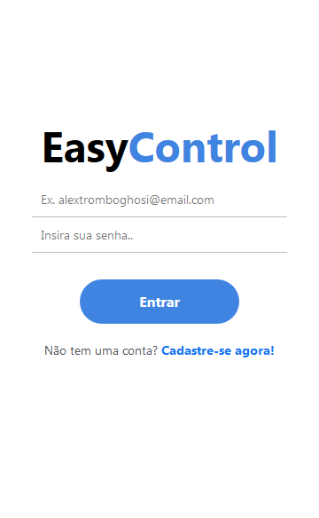
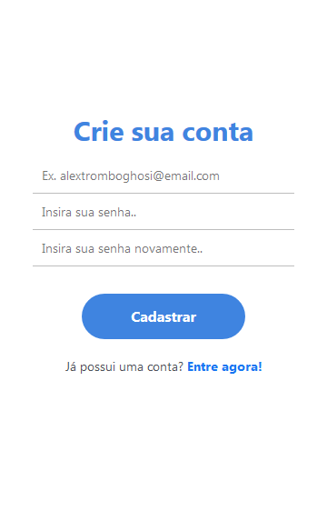
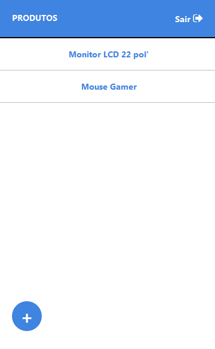
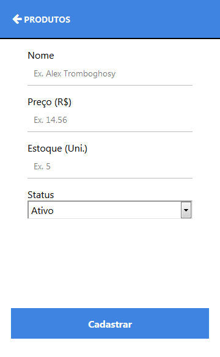
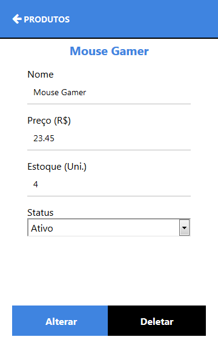

<!-- Logo -->
<p align="center">
  
</p>

<!-- Título&Descrição -->
<h2 align="left" id="screenshots">Descrição</h2>
<p align="center">Esta é uma aplicação mobile bem simples, desenvolvida com fins de estudo e aprendizado, realiza o cadastro de um novo usuário como também seu login para acesso ao sistema, dentro dele é possível listar, cadastrar, alterar e apagar um produto pertencente ao atual usuário além disto, o sisteminha conta com o loggout para desvincular o usuário até um futuro acesso.</p>

<!-- Shield -->
<p>
	</img>
    </img>
	</img>
    </img>
</p>

<!-- Screenshots -->
<h2 align="left" id="screenshots">Screenshots</h2>
<p align="center">
  
  
</p>
<p align="center">
  
  
  
</p>

<!-- Features -->
<h2 align="left" id="tecnologias">Tecnologias</h2>

As seguintes ferramentas foram usadas na construção do projeto:

- [Expo](https://expo.io/)
- [Node.js](https://nodejs.org/en/)
- [React Native](https://reactnative.dev/)
- [Firebase](https://firebase.google.com/?hl=pt)

<!-- Features -->
<h2 align="left" id="features">Features</h2>

- [x] Login do Usuário;
- [x] Logout do Usuário;
- [x] Cadastro de Usuário;
- [x] Listagem dos Produtos;
- [x] Cadastro do Produto;
- [x] Alteração do Produto;
- [x] Exclusão do Produto;

<!-- Pré-Requisitos -->
<h2 align="left" id="pre">Pré-Requisitos</h2>

Antes de começar, você vai precisar ter instalado em sua máquina as seguintes ferramentas:
[Expo](https://docs.expo.dev/get-started/installation/) e [Node.js](https://nodejs.org/en/). É bacana você possuir um editor para trabalhar com o código, fica a dica o [VSCode](https://code.visualstudio.com/). E caso você decida utilizar o seu próprio banco de dados, será necessário uma conta da [Google/@gmail](https://www.google.com/account/about/) assim, é possível acesso ao [Firebase](https://firebase.google.com/?hl=pt).

<!-- Executando o app -->
<h2 align="left" id="run">Rodando a aplicação (web)</h2>

```bash
# Clone este repositório
$ git clone https://github.com/IN0C3NC10/EasyControl.git

# Abra a pasta no seu VSCode ou editor de preferência

# Execute o projeto com
$ npm run web

#DoItUrWay
# Crie o seu próprio "Firestore Database"

# Em "Configurações do Projeto" pegue as informações 

# E substitua no seguinte caminho: "./src/config/firebaseconfig.js"

# Não se esqueça de habilitar a "leitura e escrita" no seu database

#BeHappy!
```
<!-- Autor -->
<h2 align="left" id="autor">Autor</h2>
<p>
	<a href="https://github.com/IN0C3NC10">
		
	</a>
	<br />
	Feito com ❤️ por <strong>Bruno Inocencio</strong>!
</p>

<p align="left">
  <!-- Outlook -->
  <a href="mailto:bruno.inocencio@fatec.sp.gov.br" alt="Outlook" target="_blank">
    
  </a>
  <!-- Linkedin -->
  <a href="https://cutt.ly/nQlVjQV" alt="Linkedin" target="_blank">
    
  </a>
  <!-- GitHub -->
  <a href="https://github.com/IN0C3NC10" alt="GitHub" target="_blank">
    
  </a>
</p>
